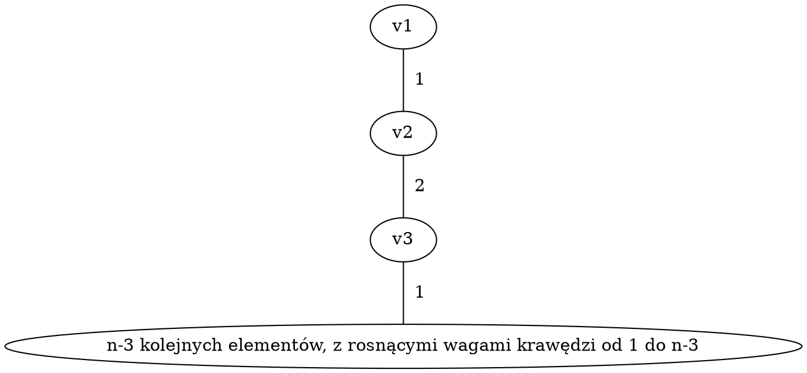

### Treść
Pokaż, że istnieją n wierzchołkowe grafy(n jest dowolnie duże), dla których algorytm Boruvki znajduje minimalne drzewo spinające wykonując dokładnie dwie fazy.

------

Rozwiązanie

    

